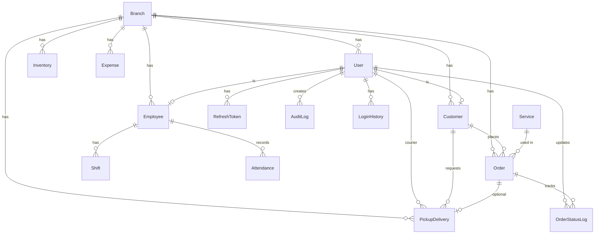

# ERD - Laundry Management System

## Relasi Utama

| Entitas | Relasi | Keterangan |
|---------|--------|------------|
| Branch | 1:N User, Customer, Order | Multi-cabang |
| User | 1:1 Customer/Employee | Role-based |
| Customer | 1:N Order | Riwayat transaksi |
| Order | 1:N OrderStatusLog | Timeline tracking |
| Service | 1:N Order | Jenis layanan |
